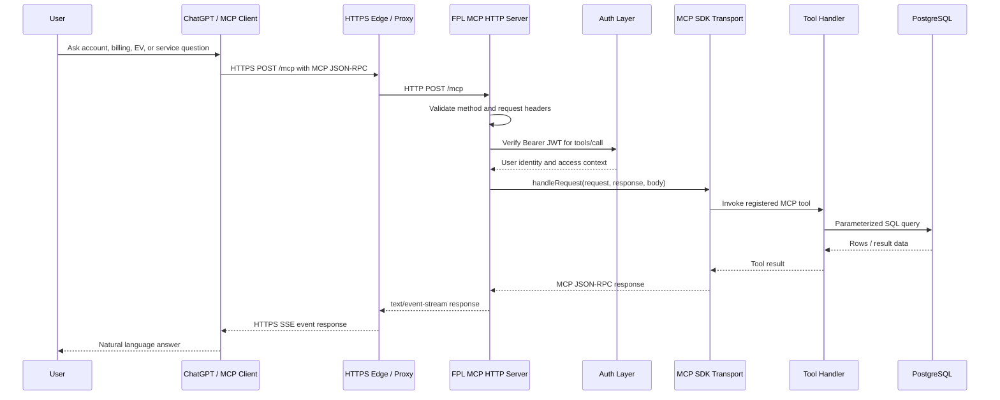
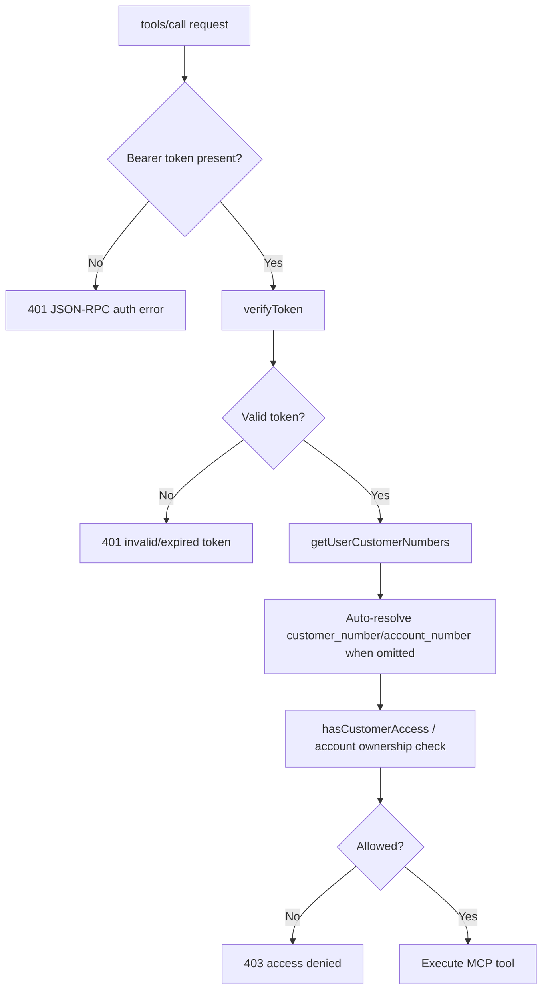
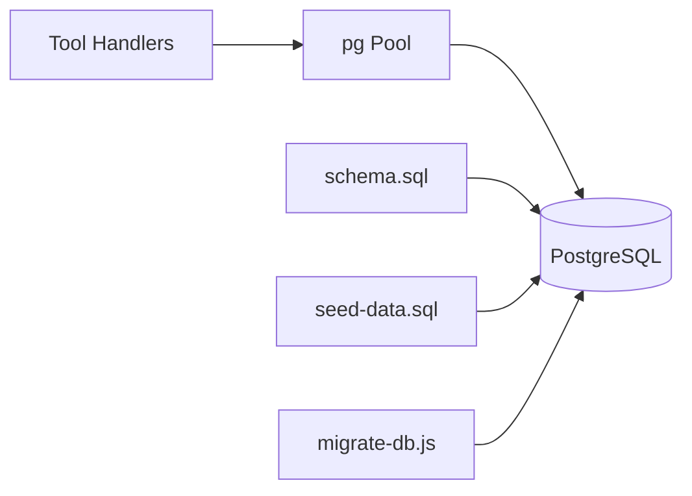
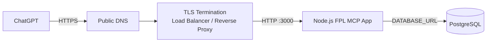

# FPL Agent MCP Architecture

## Purpose

`pocmcpserver` is a TypeScript/Node.js Model Context Protocol (MCP) server for an FPL-style customer service assistant. It exposes account, billing, EV enrollment, service order, profile, and support tools to an MCP client such as ChatGPT.

The app supports two MCP transports:

1. **Remote HTTP mode** using MCP Streamable HTTP with SSE-style `text/event-stream` responses.
2. **Local stdio mode** using stdin/stdout for local MCP clients.

## Architecture Summary

```text
ChatGPT / MCP Client
  -> HTTPS POST /mcp
  -> Hosting / reverse proxy / TLS termination
  -> Node HTTP server
  -> handleMcpRequest()
  -> JWT auth and account/customer authorization
  -> StreamableHTTPServerTransport
  -> McpServer
  -> registered FPL tool handler
  -> PostgreSQL
  -> MCP JSON-RPC result wrapped as SSE text/event-stream
  -> ChatGPT / MCP Client
```

## High-Level Component Diagram

```mermaid
flowchart LR
    User[User] --> ChatGPT[ChatGPT / MCP Client]

    ChatGPT -->|HTTPS POST /mcp\nMCP JSON-RPC| Edge[Public HTTPS Endpoint\nReverse Proxy / Hosting Layer]

    Edge -->|HTTP POST /mcp| HttpServer[Node HTTP Server\nsrc/index.ts]

    HttpServer --> Router[HTTP Route Dispatcher]

    Router --> Health[/health]
    Router --> Privacy[/privacy]
    Router --> OAuth[/oauth/* and /.well-known/*]
    Router --> McpEndpoint[/mcp]

    McpEndpoint --> Auth[JWT Verification\nAccess Control]
    Auth --> Transport[StreamableHTTPServerTransport]
    Transport --> McpServer[McpServer\nfpl-agent-mcp]

    McpServer --> Tools[FPL MCP Tools]

    Tools --> Account[Account Tools]
    Tools --> Billing[Billing Tools]
    Tools --> EV[EV Tools]
    Tools --> Service[Service Tools]
    Tools --> Customer[Customer/Profile Tools]
    Tools --> Support[Support/Audit Tools]

    Account --> DB[(PostgreSQL)]
    Billing --> DB
    EV --> DB
    Service --> DB
    Customer --> DB
    Support --> DB

    DB --> Tools
    Tools --> McpServer
    McpServer --> Transport
    Transport -->|text/event-stream\nevent: message\ndata: JSON-RPC| ChatGPT
```

## Runtime Modes

The app chooses the transport at startup from environment variables:

- If `MCP_TRANSPORT=http` or `PORT` is set, it starts the HTTP server.
- Otherwise, it starts the stdio server.

```mermaid
flowchart TD
    Start[Start src/index.ts] --> Check{MCP_TRANSPORT=http\nor PORT set?}

    Check -->|Yes| HttpMode[startHttpServer]
    Check -->|No| StdioMode[startStdioServer]

    HttpMode --> Routes[HTTP routes]
    Routes --> Mcp[/mcp endpoint]
    Mcp --> Streamable[StreamableHTTPServerTransport]

    StdioMode --> Stdio[StdioServerTransport]

    Streamable --> Server[McpServer]
    Stdio --> Server
    Server --> RegisteredTools[Registered MCP tools]
```

## HTTP/SSE MCP Flow

The remote ChatGPT-facing path is **MCP over HTTP/HTTPS with SSE-style responses**.

Important details:

- ChatGPT sends MCP JSON-RPC requests to `POST /mcp`.
- The server rejects non-POST methods for `/mcp`.
- The server ensures the request `Accept` header includes:
  - `application/json`
  - `text/event-stream`
- Normal MCP execution is delegated to `StreamableHTTPServerTransport` from `@modelcontextprotocol/sdk/server/streamableHttp.js`.
- Some MCP methods are manually returned as `Content-Type: text/event-stream` with SSE framing.

SSE response shape:

```text
event: message
data: {"jsonrpc":"2.0","id":1,"result":{"content":[...]}}

```

This is **not WebSocket**. There is no `Upgrade: websocket` flow and no `ws://` or `wss://` endpoint.

This is also more specific than generic HTTPS streaming. It uses the SSE event-stream media type and event framing.

## Sequence Diagram



## Main Code Modules

| Module | Responsibility |
| --- | --- |
| `src/index.ts` | Main app entrypoint, MCP server creation, tool registration, HTTP routes, HTTP/SSE MCP handling, OAuth endpoints, utility handlers. |
| `src/auth.ts` | User registration/login, JWT verification, user lookup, password changes, user-to-customer access checks. |
| `src/authenticated-server.ts` | Additional authenticated server support code. |
| `src/registration-api.ts` | Registration-related API support. |
| `schema.sql` | PostgreSQL schema for FPL/customer/account/billing/EV/service data. |
| `seed-data.sql` | Seed data used by local development and tests. |
| `migrate-db.js` | Database migration runner used on startup. |
| `src/tests/*` | Integration and handler tests for auth, MCP tools, HTTP transport, and edge cases. |

## MCP Server and Tool Layer

The MCP server is created by `createFplMcpServer()` in `src/index.ts`.

It creates an `McpServer` named `fpl-agent-mcp` and registers many tools with:

```typescript
server.registerTool(name, { description, inputSchema }, handler)
```

Major tool groups include:

### Account and Customer

- `get_my_account_overview`
- `get_customer_profile`
- `lookup_account`
- `get_account_summary`
- `get_premise_details`
- `update_contact_info`
- `update_notification_preferences`
- `set_preferred_language`
- `manage_authorized_users`

### Billing and Payments

- `get_billing_inquiry`
- `get_payment_history`
- `get_usage_history`
- `set_autopay`
- `cancel_autopay`
- `update_payment_method`
- `request_payment_extension`
- `get_disconnection_risk`
- `set_paperless_billing`
- `projected_next_bill`

### EV and Rate Plan

- `get_ev_enrollment`
- `check_ev_eligibility`
- `enroll_ev_charging`
- `register_vehicle`
- `update_registered_vehicle`
- `remove_registered_vehicle`
- `get_ev_charging_sessions`
- `update_ev_enrollment_plan`
- `pause_ev_enrollment`
- `cancel_ev_enrollment`
- `schedule_ev_assessment`
- `upload_garage_requirements_status`
- `get_rate_plan_options`
- `compare_rate_plan_savings`
- `get_peak_alerts`
- `recommend_ev_charging_window`

### Service Orders and Moves

- `match_property_to_customer`
- `get_service_connection_quote`
- `start_service_connection`
- `set_move_intent`
- `start_stop_transfer_service`
- `schedule_reconnect`
- `update_service_start_date`
- `get_service_orders`
- `cancel_service_order`

### Support and Audit

- `create_support_case`
- `get_case_status`
- `verify_identity_stepup`
- `audit_activity_log`

## Authentication and Authorization

For MCP `tools/call` requests, the HTTP handler requires:

```text
Authorization: Bearer <JWT>
```

The auth flow is:



The server also supports OAuth-style endpoints for ChatGPT integration:

- `/.well-known/oauth-authorization-server`
- `/.well-known/openid-configuration`
- `/oauth/authorize` and `/authorize`
- `/oauth/token` and `/token`
- `/oauth/refresh` and `/refresh`
- `/register`

## Data Architecture

The app uses PostgreSQL through the `pg` connection pool.



Data access is implemented with parameterized SQL queries to reduce SQL injection risk.

The primary data domains are:

- Users and authentication
- User-to-customer access mapping
- Customers
- Accounts
- Premises
- Billing
- Payments
- Usage history
- EV enrollment and vehicles
- Service orders
- Support and audit records

## HTTP Routes

The HTTP server exposes these main routes:

| Route | Purpose |
| --- | --- |
| `/health` | Health response with MCP and privacy paths. |
| `/privacy` | HTML privacy notice. |
| `/.well-known/oauth-authorization-server` | OAuth metadata. |
| `/.well-known/openid-configuration` | OpenID/OAuth discovery metadata. |
| `/oauth/authorize`, `/authorize` | Authorization endpoint. |
| `/oauth/token`, `/token` | Token endpoint. |
| `/oauth/refresh`, `/refresh` | Refresh endpoint. |
| `/register` | OAuth client registration endpoint. |
| `/mcp` | MCP Streamable HTTP endpoint. |

## Deployment View

Recommended deployment shape for ChatGPT remote MCP access:



The Node app itself currently uses `node:http`. For production ChatGPT use, expose it behind an HTTPS endpoint because ChatGPT remote connectors generally require a publicly reachable secure URL.

## Environment Variables

| Variable | Purpose |
| --- | --- |
| `DATABASE_URL` | PostgreSQL connection string. |
| `JWT_SECRET` | JWT signing and verification secret. |
| `MCP_TRANSPORT` | Use `http` to run HTTP/SSE mode; otherwise stdio is used unless `PORT` is set. |
| `PORT` | HTTP port. Also causes HTTP mode to start. Defaults to `3000` in HTTP mode. |
| `START_SERVER` | Set to `false` in tests to import modules without starting the server. |

## Reliability and Observability Notes

Current architecture includes request IDs and structured event logging via `logEvent()` around HTTP/MCP request handling.

Recommended production hardening:

- Terminate TLS at a managed edge or load balancer.
- Set strict CORS policy for known client origins.
- Store `JWT_SECRET` in a secret manager, not source control.
- Add request size limits and rate limiting to `/mcp` and auth endpoints.
- Add explicit database query timeouts.
- Add metrics for request count, latency, auth failures, tool calls, and database errors.
- Ensure audit logs never include secrets, raw tokens, passwords, or sensitive payment data.

## Key Architectural Decisions

### MCP transport

The app supports both stdio and Streamable HTTP. Stdio is useful for local MCP clients. Streamable HTTP is the path for ChatGPT-style remote connectors.

### SSE response format

Remote MCP responses use `text/event-stream` and SSE event framing. The payload inside the SSE `data:` field is MCP JSON-RPC.

### Stateless HTTP transport

The HTTP MCP transport is configured with:

```typescript
sessionIdGenerator: undefined
```

That means the `/mcp` endpoint is treated as stateless per request rather than maintaining server-generated MCP sessions.

### Single-process modular app

The app is currently a modular monolith: HTTP routing, MCP tool registration, auth, and database access run in one Node process. This is appropriate for the current proof-of-concept scale and makes testing/debugging simpler.

If this grows, likely extraction boundaries are:

- Auth and user/customer access service
- Account/billing service
- EV enrollment service
- Service order workflow service
- Audit/support service

## Current Test Architecture

Tests are integration-heavy and use PostgreSQL-backed setup helpers.

Major test areas:

- Auth behavior
- MCP tool registration and invocation
- HTTP transport behavior
- Account tools
- Billing tools
- Customer tools
- EV tools
- Service tools
- Support tools
- Aggressive edge cases and error handling

The tests are valuable not only for coverage but also for bug discovery across API and MCP tool behavior.
